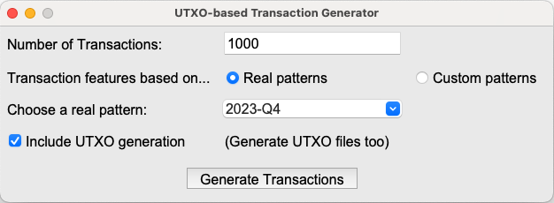
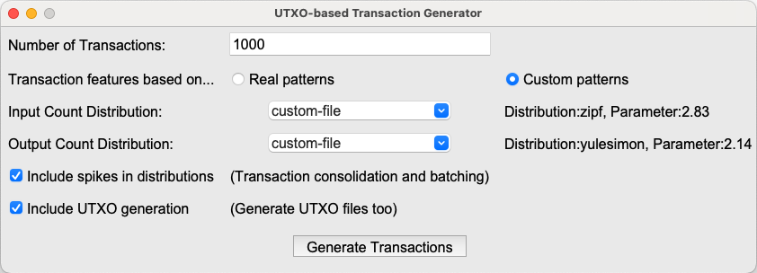

# UTXO-based transaction workload generator

## Prerequisites
Before running this application, make sure you have the following installed:
1. **Python:** Ensure you have Python 3 installed on your system. You can download it from [here](https://www.python.org/downloads/).
2. **Required Python Packages:** The following Python libraries are required to be installed:
  >- pandas (for data manipulation and analysis)
  >- numpy (for numerical computations)
  >- scipy (for statistical distributions)
  >- tk (for visualization) 

## Run the application:
### On Mac/Linux:
- python3 generator.py
### On Windows:
- python generator.py

## The generator GUI

Below is graphical the user interface of the UTXO-based transaction workload generator:

The figure above represents the generator options for creating transactions based on real-world patterns.

The figure above represents the generator options for creating transactions based on custom patterns.

